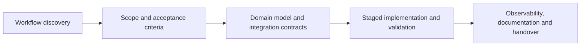

<h1 align="center">Tuğrul Yıldırım</h1>

  <strong>Independent CRM, ERP & Integration Engineer</strong> 
  Manufacturing · Wholesale · Distribution · Complex B2B Operations

  <a href="https://tugrulyildirim.com?utm_source=github&amp;utm_medium=profile&amp;utm_campaign=brand">Website</a> ·
  <a href="https://tugrulyildirim.com/projects?utm_source=github&amp;utm_medium=profile&amp;utm_campaign=brand">Case Studies</a> ·
  <a href="https://tugrulyildirim.com/blog?utm_source=github&amp;utm_medium=profile&amp;utm_campaign=brand">Insights</a> ·
  <a href="https://www.linkedin.com/in/tugrulyildirim/">LinkedIn</a> ·
  <a href="mailto:contact@tugrulyildirim.com">Email</a>

---

## What I Build

I design and build Laravel-based CRM, ERP, B2B portal, SaaS and API integration systems for manufacturing, wholesale and other operationally complex businesses.

My work helps teams replace spreadsheets, reduce duplicate data and control the workflows that connect sales, quoting, orders, inventory, procurement and finance.

I am most useful when standard software cannot reflect the real process, existing systems need a reliable integration layer, or business-critical workflows require clearer ownership, approvals and traceability.

### Core delivery areas

- **Custom CRM:** account management, pipelines, follow-ups, quoting, approvals and customer history
- **Custom ERP:** procurement, inventory, order management, finance handoffs and operational reporting
- **CRM–ERP integration:** data ownership, API contracts, idempotency, retries, reconciliation and observability
- **B2B portals:** account-specific catalogs, pricing, approvals, order tracking, documents and notifications
- **Workflow automation:** RFQ-to-order, quote-to-cash, procure-to-pay and returns/claims processes
- **SaaS platforms:** multi-tenancy, roles, entitlements, subscriptions and operational administration

---

## Business Workflows I Focus On

| Workflow | Typical scope |
|---|---|
| **Quote-to-Cash** | Lead qualification, pricing rules, quote revisions, margin approval, order handoff and invoice alignment |
| **Procure-to-Pay** | Purchase requests, supplier RFQs, comparison, approvals, purchase orders, goods receipt and invoice matching |
| **Inventory Control** | Multi-warehouse movements, adjustments, traceability, cycle counts, reorder rules and audit history |
| **CRM–ERP Synchronization** | Customers, products, prices, stock, quotes, orders, invoices, retries and reconciliation |
| **B2B Order Management** | Customer-specific catalogs, availability, approval chains, partial shipments, documents and status mapping |
| **Returns & Claims** | Intake, inspection, disposition, credits, replacement flows and root-cause tracking |

---

## Engineering Approach

I treat operational software as business infrastructure—not a collection of screens.

### Principles

- Workflows before screens
- Clear data ownership before synchronization
- Idempotency before automatic retries
- Reconciliation for every critical integration
- Role-based permissions and audit trails by design
- Staged delivery instead of high-risk big-bang releases
- Documentation and code ownership as standard deliverables

---

## Selected Case Studies

### [Factory ERP Foundation](https://tugrulyildirim.com/projects/factory-erp-foundation-crm-workflow?utm_source=github&utm_medium=profile&utm_campaign=proof)

A manufacturing ERP foundation connecting sales, stock, purchasing and finance workflows with controlled permissions, approvals and traceability.

`Laravel` `ERP Workflows` `Inventory` `Procurement` `RBAC` `API Integration`

### [Manufacturing RFQ-to-Order Workflow](https://tugrulyildirim.com/projects/anonymous-rfq-quote-to-order-workflow?utm_source=github&utm_medium=profile&utm_campaign=proof)

An anonymized workflow covering RFQ intake, technical review, BOM and lead-time checks, quote revisions, margin approvals and ERP order handoff.

`RFQ Management` `Approval Matrix` `Quoting` `CRM–ERP Integration`

### [B2B Ordering and Tracking Portal](https://tugrulyildirim.com/projects/anonymous-b2b-ordering-tracking-portal?utm_source=github&utm_medium=profile&utm_campaign=proof)

An anonymized B2B portal architecture for account-specific catalog access, ERP status mapping, order tracking, documents and customer notifications.

`B2B Portal` `ERP Sync` `Order Tracking` `Customer Roles`

  <a href="https://tugrulyildirim.com/projects?utm_source=github&amp;utm_medium=profile&amp;utm_campaign=proof"><strong>View all case studies →</strong></a>

---

## Open-Source Work

### [Marketplace Integrator](https://github.com/developertugrul/marketplace-integrator)

A memory-efficient PHP library that normalizes product and order data from Trendyol and Amazon into unified models. It includes generator-based processing, status normalization and configurable field mapping.

### [PayTR Laravel Client](https://github.com/developertugrul/paytr-laravel-client)

A Laravel package for PayTR payment flows, refunds, cancellations, card storage and webhook verification, with HMAC signing, validation and documented integration examples.

### [Garanti BBVA Virtual POS](https://github.com/developertugrul/garanti-pos)

A Laravel package covering Garanti BBVA Virtual POS flows, including XML requests, 3D Secure, GarantiPay, refunds, cancellations and payment-response validation.

  <a href="https://github.com/developertugrul?tab=repositories"><strong>Browse all public repositories →</strong></a>

---

## Technology Stack

### Application engineering

`PHP` · `Laravel` · `Livewire` · `React` · `TypeScript` · `Flutter`

### Data and infrastructure

`PostgreSQL` · `MySQL` · `PostGIS` · `Redis` · `Queues` · `Docker` · `CI/CD`

### Integration and governance

`REST APIs` · `Webhooks` · `OpenAPI` · `OAuth` · `RBAC` · `Audit Logs` · `Observability`

---

## Free CRM–ERP Tools

### [CRM–ERP Integration Health Check](https://tugrulyildirim.com/tools/crm-erp-integration-health-check?utm_source=github&utm_medium=profile&utm_campaign=tools)

Assess idempotency, retries, observability, reconciliation, security and governance. The tool returns an immediate prioritized improvement plan.

### [iPaaS vs Custom Integration TCO Calculator](https://tugrulyildirim.com/tools/ipaas-vs-custom-tco-calculator?utm_source=github&utm_medium=profile&utm_campaign=tools)

Compare multi-year costs across custom, iPaaS and hybrid integration models, including connector fees, maintenance and incident risk.

---

## Working With Me

I work remotely from Istanbul with international clients and technical teams.

Typical engagements include:

1. **Integration & Architecture Review** — workflow, data-flow and reliability assessment
2. **CRM/ERP Foundation Build** — staged delivery of the operational core
3. **System Modernization** — legacy workflow and integration improvement
4. **Stabilization & Support** — performance, reliability, observability and controlled iteration

Every engagement can include:

- Clear scope, milestones and acceptance criteria
- NDA and confidentiality controls
- Staged releases and progress visibility
- API and operational documentation
- Code ownership and structured handover

---

## Start With a Practical Review

If your business is managing critical CRM, ERP, inventory, procurement or order workflows across spreadsheets and disconnected systems, send me a short description of:

- Your current tools
- The workflow causing the most friction
- The systems that need to exchange data
- Your expected timeline

I will review the context and suggest the most practical next step.

  <a href="https://tugrulyildirim.com/contact-me?topic=project-quote&amp;utm_source=github&amp;utm_medium=profile&amp;utm_campaign=lead_generation&amp;utm_content=readme_cta"><strong>Discuss a Project</strong></a> ·
  <a href="https://tugrulyildirim.com/integration-reliability-review?utm_source=github&amp;utm_medium=profile&amp;utm_campaign=lead_generation&amp;utm_content=readme_cta"><strong>Request an Integration Review</strong></a> ·
  <a href="mailto:contact@tugrulyildirim.com"><strong>contact@tugrulyildirim.com</strong></a>

